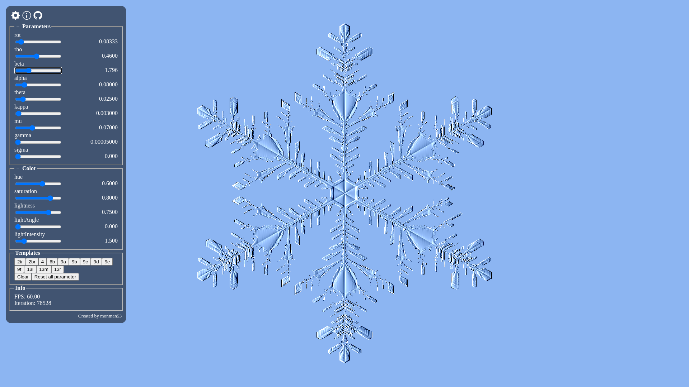

# snowflake

This is an unofficial implementation of J. Gravner, D. Griffeath,
_MODELING SNOW CRYSTAL GROWTH II: A mesoscopic lattice map with plausible dynamics_
Physica D: Nonlinear Phenomena, Volume 237, Issue 3, 2008, Pages 385-404

## Screenshots



## Development

```sh
# Initial setup
npm install

# Launch development server
npm run dev

# Build
npm run build
```
