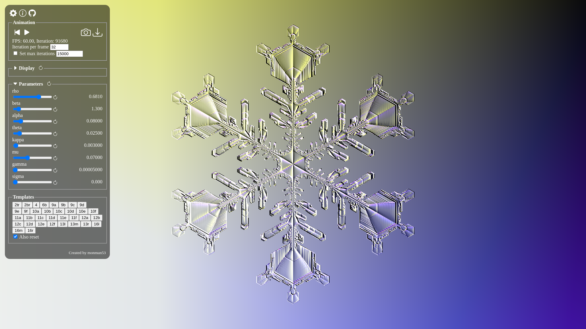

# snowflake

This is a snowflake formation simulator works interactively on web.

Try it -> https://monman53.github.io/snowflake/ (Warning: Heavy computation)

The numerical model is from J. Gravner, D. Griffeath work[^1], and lighting is inspired by Kenneth G. Libbrecht's photography[^2].

[^1]:
    J. Gravner, D. Griffeath,
    _MODELING SNOW CRYSTAL GROWTH II: A mesoscopic lattice map with plausible dynamics_
    Physica D: Nonlinear Phenomena, Volume 237, Issue 3, 2008, Pages 385-404

[^2]: https://www.snowcrystals.com/

## Screenshots




## Development

```sh
# Initial setup
npm install

# Launch development server
npm run dev

# Build
npm run build
```
